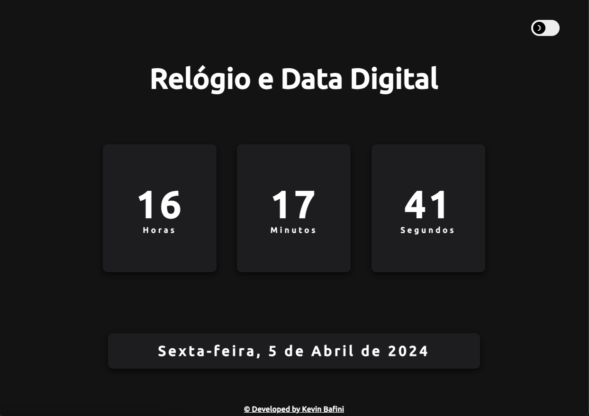
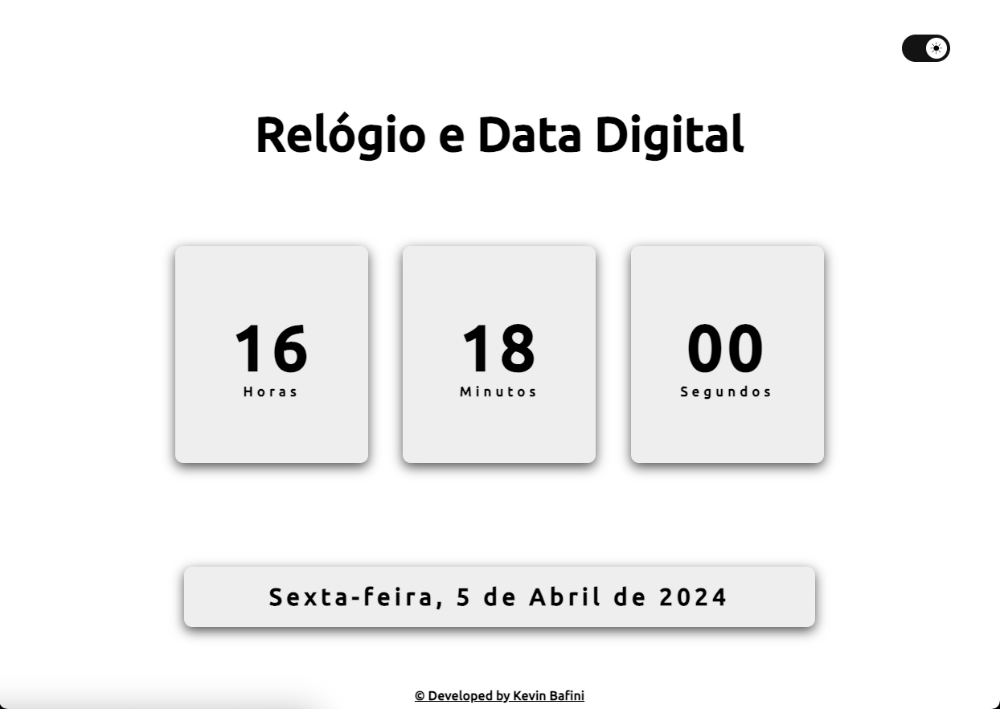

<h1 align="center">Relógio e Data Digital</h1>

Esse projeto foi desenvolvido especialmente para o aprendizado e especificação das tecnologias abaixo.

## Recursos:

* Exibição da Hora e Data: O relógio digital mostra a hora atual, os minutos, os segundos e a data.
* Alternância de Tema: Os usuários podem alternar entre um tema claro e um tema escuro, adequando-se às suas preferências visuais.
* Design Responsivo: O layout é completamente responsivo, adaptando-se bem a diferentes tamanhos de tela e dispositivos.

## 🛠 Tecnologias

As seguintes ferramentas foram usadas na construção do projeto:

- HTML5
- CSS3 (com Variáveis CSS para facilitar a alternância de temas)
- JavaScript (para funcionalidades interativas como a alternância de tema e o modo de tela cheia)

<h2 align="center">✅ Demonstração da aplicação</h2>

 
<h3 align="center"> Tema escuro</h3>

 

<h3 align="center"> Tema claro</h3>

## Autor

<h3 font-weight: 900;>Feito por Kevin Bafini</h3>

